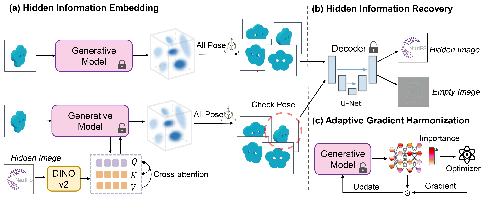

# GaussianStego: Embedding Invisible Information within Generative 3D Gaussian Splatting

<!-- <i>The avatar is generated by stable diffusion.</i> -->

### [Project Page](https://gaussian-stego.github.io/) | [ArXiv Paper](https://arxiv.org/abs/2407.01301)
### Arxiv 2024

[Chenxin Li](https://xggnet.github.io/)1†, 
[Hengyu Liu](https://github.com/LiuHengyu321)1†, 
[Zhiwen Fan](https://zhiwenfan.github.io/)2,
[Wuyang Li](https://wymancv.github.io/wuyang.github.io/)1,
[Yifan Liu](https://yifliu3.github.io/)1,
[Panwang Pan](https://paulpanwang.github.io/)3,
[Yixuan Yuan](https://www.ee.cuhk.edu.hk/en-gb/people/academic-staff/professors/prof-yixuan-yuan)1‡

1 CUHK, 2UT Austin, 3ByteDance, 

† denotes equal contribution, ‡ denotes corresponding author. 

-------------------------------------------

## Highlights 
- While standardized methods for embedding proprietary or copyright information, either overtly or subtly, exist for conventional visual content such as images and videos, this issue remains unexplored for emerging generative 3D formats like Gaussian Splatting.
- We present GaussianStego, a method for embedding steganographic information in the rendering of generated 3D assets. Our approach employs an optimization framework that enables the accurate extraction of hidden information from images rendered using Gaussian assets derived from large models, while maintaining their original visual quality.
- We conduct preliminary evaluations of our method across several potential deployment scenarios and discuss issues identified through analysis. GaussianStego represents an initial exploration into the novel challenge of embedding customizable, imperceptible, and recoverable information within the renders produced by current 3D generative models, while ensuring minimal impact on the rendered content's quality.
